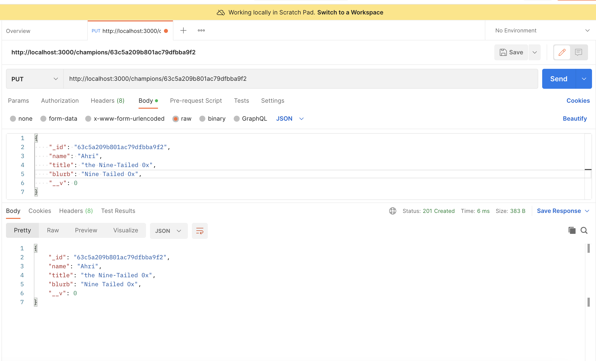

# Intro #
JSON API built with express and mongoose with CRUD functionality and RESTful routes. 

https://riot-api-project-production.up.railway.app/

https://riot-api-project-production.up.railway.app/champions

## Initializing ##
* Run npm db:seed to seed within localhost. 
* Run nodemon server.js to open server within localhost. 
* Root directory is at http://localhost:3000/
* Full list is at http://localhost:3000/champions
* CRUD functionality by id using http://localhost:3000/:id

## Fetching the API ##
Initial version of project was to fetch summoner profile by using RIOT API developer key but for the sake of accessibility, it only allows fetching for private data. Reiterated project version to fetch champion data from general API. 

## CRUD ##
CRUD functions tested within POSTman

Get list of all champions in directory

Post a fake champion entry

Update an entry 

Deleting Previous entry

